# 🚀 Talkative: The Future of Secure & Intelligent Communication


-red?style=for-the-badge)

 **Talkative** is a high-performance, privacy-first communication platform that bridges the gap between traditional real-time messaging and modern AI-driven collaboration. Built with a focus on scalability and security, it ensures your data remains yours while providing intelligent tools to boost productivity.
 
 🌐 **Live Demo:** [https://talkative.com ](https://talkative-3ndq.onrender.com/)

---

## ✨ Key Features

### 🛡️ Privacy & Security
- **End-to-End Encryption (E2EE):** All messages are encrypted in the browser using RSA (for key exchange) and AES-GCM (for message content). The server *never* sees plain text.
- **Secure Chat Codes:** Simple yet secure connection system for private 1-on-1 chats.
- **Privacy-First Storage:** Media is handled via Cloudinary with secure delivery, while text remains encrypted and stateless on the backend.

### 🤖 AI Intelligence
- **AI Assistant:** A dedicated, persistent AI bot (Llama 3 via Groq) available for every user to help with tasks, summaries, and information.
- **Smart Replies:** Context-aware suggestions powered by sub-second AI inference, making conversations faster and more fluid.

### ⚡ Real-Time Excellence
- **Global Scaling:** Distributed architecture using **Redis Pub/Sub** and the Socket.io Redis Adapter. Ready to handle thousands of concurrent users across multiple server instances.
- **Dynamic Presence:** Real-time online status tracking, typing indicators, and read receipts (blue ticks).
- **Voice & Media:** High-quality image sharing and voice notes powered by Cloudinary.
- **Video Calling:** Peer-to-peer 4K video streams leveraging WebRTC signaling hooks.

---

## 🛠️ Tech Stack

### Frontend
- **Framework:** React 18 with Vite
- **Styling:** Tailwind CSS + DaisyUI (Premium UI Components)
- **State Management:** Zustand (Minimal, Hook-based)
- **Icons:** Lucide React
- **Real-time:** Socket.io-client
- **Security:** Web Crypto API (SubtleCrypto)

### Backend
- **Runtime:** Node.js (Express)
- **Database:** MongoDB (via Mongoose)
- **Message Broker:** Redis (for stateless scaling)
- **AI Engine:** Groq SDK (Llama 3) / Google Generative AI
- **File Storage:** Cloudinary
- **Authentication:** JWT + Cookie Parser

---

## 🏗️ Architecture Overview

 Talkative is designed as a **Stateless Backend** system. By offloading session data and global state to Redis, the application can be horizontally scaled infinitely without losing user status or breaking WebSocket connections.

```mermaid
flowchart TD
    %% Title
    subgraph "Secure Real-Time Communication Platform"
        direction LR
        
        %% ===== USER SIDE =====
        subgraph "Client Layer"
            direction TB
            
            subgraph "User A Browser"
                UA1[UI: Compose<br/>Message/Call/AI Query]
                UA2[WebSocket Client]
                UA3[Encryption Engine<br/>Web Crypto API]
                UA4[Local Key Storage<br/>IndexedDB]
                
                UA1 --> UA2
                UA2 --> UA3
                UA3 --> UA4
            end
            
            subgraph "User B Browser"
                UB1[UI: Display<br/>Messages/Calls]
                UB2[WebSocket Client]
                UB3[Decryption Engine<br/>Web Crypto API]
                UB4[Local Key Storage<br/>IndexedDB]
                
                UB2 --> UB3
                UB3 --> UB4
                UB1 --> UB2
            end
        end

        %% ===== COMMUNICATION FLOW =====
        UA3 -- "① Encrypt with Recipient's<br/>Public Key" --> UA2
        UA2 -- "② Send Encrypted<br/>via WebSocket (wss://)" --> WS1
        
        WS1 -- "③ Broadcast via<br/>Redis Pub/Sub" --> Redis
        Redis -- "④ Push to Recipient" --> WS1
        WS1 -- "⑤ Deliver Encrypted<br/>Message" --> UB2
        
        UB2 -- "⑥ Decrypt with<br/>Local Private Key" --> UB3
        UB3 --> UB1
        
        %% ===== BACKEND CORE =====
        subgraph "Backend Layer"
            direction TB
            
            WS1[WebSocket Gateway<br/>Socket.io Server]
            API1[API Server<br/>Express.js]
            
            WS1 <--> API1
        end
        
        subgraph "Real-time Layer"
            Redis[Redis Cloud<br/>Pub/Sub & Presence]
        end
        
        %% ===== DATA STORAGE =====
        subgraph "Data Storage Layer"
            direction TB
            
            subgraph "Primary Database"
                MongoDB[MongoDB Atlas<br/>• Messages<br/>• Contacts<br/>• Encrypted Data]
            end
            
            subgraph "Media Storage"
                Cloudinary[Cloudinary<br/>• Images<br/>• Voice Messages<br/>• Video Clips]
            end
            
            subgraph "Key Management"
                KeyRegistry[Public Key Registry<br/>User Public Keys]
            end
        end
        
        %% ===== AI INTEGRATION =====
        subgraph "AI Service Layer"
            AI1[AI Service<br/>Groq LLM Integration]
        end
        
        %% ===== CONNECTIONS =====
        API1 -- "Store Message Metadata" --> MongoDB
        API1 -- "Upload/Retrieve Media" --> Cloudinary
        API1 -- "Lookup Public Keys" --> KeyRegistry
        
        API1 -- "Process AI Queries" --> AI1
        AI1 -- "Return Encrypted AI Response" --> API1
        API1 -- "Route AI Response" --> WS1
        
        %% ===== STATUS TRACKING =====
        WS1 -- "Update Online Status" --> Redis
        Redis -- "Presence Updates<br/>to All Users" --> WS1
    end

    %% ===== LEGEND =====
    subgraph " "
        direction LR
        L1[Data Flow] --- L2[Real-time Connection] --- L3[Storage Access] --- L4[Service Call]
    end
    
    %% Styling
    classDef client fill:#e3f2fd,stroke:#1565c0,stroke-width:2px
    classDef backend fill:#f3e5f5,stroke:#7b1fa2,stroke-width:2px
    classDef realtime fill:#fff3e0,stroke:#f57c00,stroke-width:2px
    classDef storage fill:#e8f5e8,stroke:#2e7d32,stroke-width:2px
    classDef ai fill:#fff8e1,stroke:#ff8f00,stroke-width:2px
    classDef legend fill:#f5f5f5,stroke:#9e9e9e,stroke-width:1px
    
    class UA1,UA2,UA3,UA4,UB1,UB2,UB3,UB4 client
    class WS1,API1 backend
    class Redis realtime
    class MongoDB,Cloudinary,KeyRegistry storage
    class AI1 ai
    class L1,L2,L3,L4 legend
```



---

## 🚀 Getting Started

### Prerequisites
- Node.js (v18+)
- MongoDB Atlas account
- Redis instance (Upstash recommended)
- Cloudinary account
- Groq API Key

### Installation

1. **Clone the repository:**
   ```bash
   git clone https://github.com/yourusername/teamsync.git
   cd teamsync
   ```

2. **Setup Backend:**
   ```bash
   cd backend
   npm install
   ```
   Create a `.env` file in the `backend` directory:
   ```env
   PORT=5001
   MONGODB_URI=your_mongodb_uri
   JWT_SECRET=your_jwt_secret
   CLOUDINARY_CLOUD_NAME=your_cloud_name
   CLOUDINARY_API_KEY=your_api_key
   CLOUDINARY_API_SECRET=your_api_secret
   REDIS_URL=your_redis_url
   GROQ_API_KEY=your_groq_api_key
   NODE_ENV=development
   ```

3. **Setup Frontend:**
   ```bash
   cd ../frontend
   npm install
   ```
   (Optional) Update `VITE_BASE_URL` if running on a custom port.

### Running the App

1. **Start Backend:**
   ```bash
   cd backend
   npm run dev
   ```

2. **Start Frontend:**
   ```bash
   cd frontend
   npm run dev
   ```

---


## 💎 Project Rationale

*"Talkative isn't just a chat app; it's a secure, AI-augmented infrastructure designed for the modern era of privacy. I chose a distributed architecture (Redis/Atlas) to ensure that as the user base grows, the system stays fast, and as privacy laws get stricter, the E2EE remains unbreakable."*

---

---
Built with ❤️ by Prakhar
